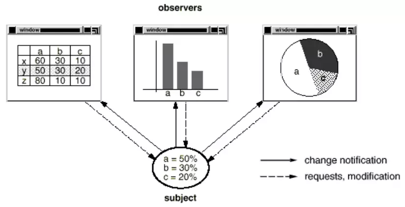

#### Observer Pattern là gì?

- <i> <b> Observer Pattern </b> </i> là một trong những Pattern thuộc nhóm hành vi (Behavior Pattern). Nó định nghĩa mối phụ thuộc một – nhiều giữa các đối tượng để khi mà một đối tượng có sự thay đổi trạng thái, tất các thành phần phụ thuộc của nó sẽ được thông báo và cập nhật một cách tự động.

- <i> <b> Observer </b> </i> có thể đăng ký với hệ thống. Khi hệ thống có sự thay đổi, hệ thống sẽ thông báo cho Observer biết. Khi không cần nữa, mẫu Observer sẽ được gỡ khỏi hệ thống.

`Giả sử chúng ta có một bảng tính excel với nhiều trang tính chứa các dữ liệu cần để thống kê. Ta có thể tạo ra vô số biểu đồ sử dụng dữ liệu ở các trang tính đó để hiển thị ra kết quả thống kê. Khi ta thay đổi dữ liệu ở một trang tính, các biểu đồ có sử dụng dữ liệu đó cũng phải được cập nhật để có số liệu thống kê chính xác. Ta có thể thấy là số lượng biểu đồ có thể dùng dữ liệu ở một trang tính là không giới hạn.`



`Thường sử dụng trong lập trình hướng sự kiện, khi thay đổi trạng thái. VD: Khi một nút được nhấn hoặc một trường dữ liệu được cập nhật, giao diện có thể tự động cập nhật để phản ánh những thay đổi đó, như hiển thị thông báo hoặc vô hiệu hóa một nút. `

#### Cài đặt Observer Pattern như thế nào?


- <b> Subject </b> : chứa danh sách các observer, cung cấp phương thức để có thể thêm và loại bỏ observer.
- <b> Observer </b> : định nghĩa một phương thức update() cho các đối tượng sẽ được subject thông báo đến khi có sự thay đổi trạng thái.
- <b> ConcreteSubject </b> : cài đặt các phương thức của Subject, lưu trữ trạng thái danh sách các ConcreateObserver, gửi thông báo đến các observer của nó khi có sự thay đổi trạng thái.
- <b> ConcreteObserver </b> : cài đặt các phương thức của Observer, lưu trữ trạng thái của subject, thực thi việc cập nhật để giữ cho trạng thái đồng nhất với subject gửi thông báo đến.

```typescript
// Observer interface
interface Observer {
  update: (data: number) => void;
}

// Subject interface
interface Subject {
  subscribe: (observer: Observer) => void;
  unsubscribe: (observer: Observer) => void;
  notifyObservers: () => void;
}

class ConcreteSubject implements Subject {
  private observers: Observer[] = [];
  private state: number = 0;

  subscribe(observer: Observer): void {
    this.observers.push(observer);
  }

  unsubscribe(observer: Observer): void {
    const index = this.observers.indexOf(observer);
    if (index > -1) {
      this.observers.splice(index, 1);
    }
  }

  notifyObservers(): void {
    for (const observer of this.observers) {
      observer.update(this.state);
    }
  }

  changeState(state: number): void {
    this.state = state;
    this.notifyObservers();
  }
}

class ConcreteObserver implements Observer {
  private id: number;

  constructor(id: number) {
    this.id = id;
  }

  update(data: number): void {
    console.log(`[Observer ${this.id}] received update with data: ${data} !`);
  }
}

const main = () => {
  const subject = new ConcreteSubject();
  const observer1 = new ConcreteObserver(1);
  const observer2 = new ConcreteObserver(2);

  subject.subscribe(observer1);
  subject.subscribe(observer2);

  subject.changeState(10);

  subject.unsubscribe(observer2);

  subject.changeState(20);
};
main();
```
