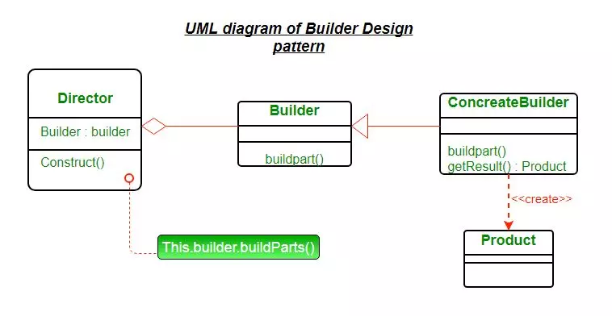

#### Được sử dụng khi class có quá nhiều thuộc tính, hàm khởi tạo phải truyền nhiều đối số 

- đôi lúc sẽ nhầm lẫn không biết phải truyền thuộc tính nào vào trước thuộc tính nào vì có nhiều đối số được truyền vào constructor đấy

- hoặc đôi lúc chỉ cần khởi tạo với 1 vài thuộc tính cụ thể chứ không phải khởi tạo với toàn bộ => viết thêm constructor mới, hoặc truyền null vào những thuộc tinh không cần dùng

#### Example:

```
Giă sử có một Class Home {
    private String name;
    private String address;
    private String owner; 
    private Date createdAt;

    public Home(String name, String address, String owner, Date createdAt) {
        this.name = name;
        this.address = address;
        this.owner = owner;
        this.createdAt = createdAt;
    }
}
```

Bình thường khi cần tạo thêm 1 đối tượng sẽ khởi tạo qua ``new Home("Nhà Đức Anh", "Hà Tây", "Đức Anh", 2015)`` nhưng nếu như có một số trường hợp chỉ khởi tạo với address, owner khi đấy sẽ phải tạo thêm 1 constructor nữa là 

```
public Home(String address, String owner) {
    this.address = address;
    this.owner = owner;
}
(làm cho code dài)
```

hoặc sẽ khởi tạo với hàm constructor cũ nhưng truyền thêm giá trị null như ``new Home(null, "Hà Tây", "Đức Anh", null)`` <i>(làm cho code xấu) </i>

Hoặc nếu như sau này Class cần thêm một thuộc tính nữa là ``numberPeople``, nếu như lại tạo thêm 1 đối số vào các constructor đang dùng thì sẽ phải sửa lại tất cả các đoạn code đã từng new Home đấy <i>(vì hàm khởi tạo cần đủ 5 đối số, nhưng ở các đoạn code trước đó chỉ truyền có 4)</i>



- Product : đại diện cho đối tượng cần tạo, đối tượng này phức tạp, có nhiều thuộc tính.
- Builder : là abstract class hoặc interface khai báo phương thức tạo đối tượng.
- ConcreteBuilder : kế thừa Builder và cài đặt chi tiết cách tạo ra đối tượng. Nó sẽ xác định và nắm giữ các thể hiện mà nó tạo ra, đồng thời nó cũng cung cấp phương thức để trả các các thể hiện mà nó đã tạo ra trước đó.


```typescript
// Product
class Student {
  private id: string;
  private firstName: string;
  private lastName: string;

  constructor(id: string, firstName: string, lastName: string) {
    this.id = id;
    this.firstName = firstName;
    this.lastName = lastName;
  }
}

// Builder
interface StudentBuilder {
  setId: (id: string) => StudentBuilder;
  setFirstName: (firstName: string) => StudentBuilder;
  setLastName: (lastName: string) => StudentBuilder;
  build: () => Student;
}

// ConcreteBuilder
class StudentConcreteBuilder implements StudentBuilder {
  private id: string;
  private firstName: string;
  private lastName: string;

  public setId(id: string): StudentBuilder {
    this.id = id;
    return this;
  }

  public setFirstName(firstName: string): StudentBuilder {
    this.firstName = firstName;
    return this;
  }

  public setLastName(lastName: string): StudentBuilder {
    this.lastName = lastName;
    return this;
  }

  public build(): Student {
    return new Student(this.id, this.firstName, this.lastName);
  }
}
```